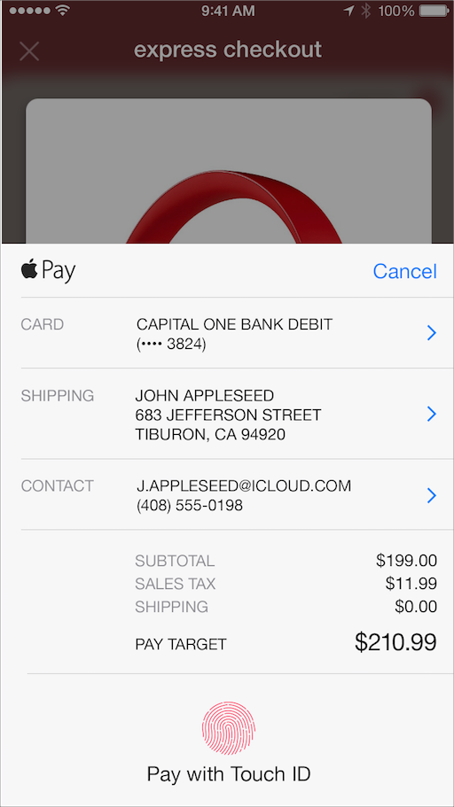
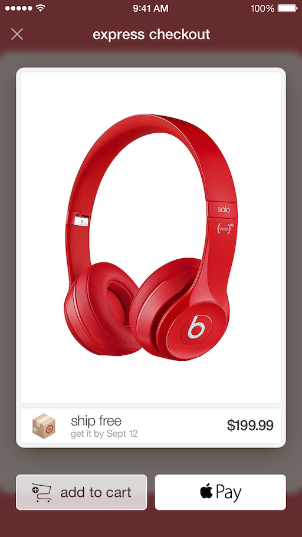

# 苹果支付

苹果支付是一种 iOS 设备上简单、安全和私密的支付方式。当人们在应用程序中购买实物商品和服务时，可以使用苹果支付迅速和安全地提供他们的联系方式、运送和支付信息。

使用苹果支付，用户可以在购物时无需创建一个帐户或输入信息。苹果支付明显加快了结算流程，帮助免除预先注册，为用户提供了更好的浏览商品和一站式服务购买的体验。有关更多信息，请参见 [Apple Pay Programming Guide](https://developer.apple.com/library/ios/ApplePay_Guide/index.html#//apple_ref/doc/uid/TP40014764)。

苹果支付界面简洁流畅。它由三个部分组成,分别出现在不同的情境中:

**按钮。**苹果支付按钮显示表明用户可以从当前界面进行购买，如产品页面。当用户点击苹果支付按钮，他们应该会看到付款表，然后开始结帐过程。

**支付标志。**当用户需要选择一个支付方式并在付款前确认信息时，他希望看到苹果支付的支付标志。当其他的付款方式显示在相同或相似的位置时苹果支付的标志也应该出现。

**付款单。**用户在提交订单和进行相关的付款之前，苹果支付会显示付款表，其中包括联系方式、运送信息以及其他和付款相关的信息。用户可以在付款表中做一些更改，如选择另一种运送方式，他不需要修改订单或输入附加信息。当用户看到付款表时，他们能够立即完成交易并授权支付。

**如果用户不能使用苹果支付则不显示任何苹果支付界面。**如果有人没有经过身份验证卡设置或使用的设备不支持苹果支付，作为付款选项显示可能会误导他们。此外，如果人们还没有使用的话避免提示他们设置苹果支付。

**用户点击苹果支付按钮后立即显示付款表。**用户决定使用苹果支付进行付款后，如果后续步骤繁琐会使支付过程复杂化并使用户感到低效。在用户点击苹果支付按钮后避免使用额外的警告提示或视图。

**苹果支付按钮的显示大小与其他付款按钮的大小相同或大一些。**突出显示苹果支付按钮能帮助用户轻松地找到它。

更多关于如何使用苹果支付按钮和付款标志的指导，详见 [Apple Pay Identity Guidelines](https://developer.apple.com/apple-pay/Apple-Pay-Identity-Guidelines.pdf)。

## 自定义付款单

你可以根据完成交易需要知道的信息以及要传达给用户的购买信息，来自定义苹果支付付款单的显示内容。

**确保只在付款单上显示完成交易必要的信息。**如果苹果支付付款单显示无关的信息，用户可能会感到困惑或担心。例如，如果商品的交付或履行是采用电子方式，索要联系人的一个电子邮件地址而不是一个送货地址会更有意义。索要一个送货地址在这种情况下可能会给用户留下了这样的印象:东西会运到家里或工作单位，还可能担心自己留下了不必要的个人信息。

**让用户在付款单选择自己的送货方法。**用户可以从苹果支付付款单内指定的多种付款方法中选择一个合适的支付方法。用户可指定运输方法、使用标签、运输费用和一个可选的预估送货日期。

**添加要购买的商品时使用行式项目。**一个行项目包括一个标签和一个价格。它显示了用户购买时的细分账单信息。使用行项目可以：

- 用行项目显示用户授权的重复付款，如“月供19.99美元”

- 告知用户的额外支出，如“礼物包装5.00美元”或“税费4.53美元”

- 显示负花费的优惠券或折扣，如“周五折扣-2.00美元”

避免使用行项目显示一个分项列表的产品。

**尽可能创建可以显示在一行的行项目标签。**行项目的标签应该是具体的和容易被用户理解的。冗长的标签很难使用户一目了然的理解行项目。

**在“支付”这个词后同一行提供一个商家名称。**这有助于使用户消除顾虑，他们的付款到了该去的地方。

**确保沟通，因为授权支付时如果总金额是未知的，可能会有额外的费用。**用户可以授权苹果支付进行总额不确切的支付服务。例如，用距离或时间计算汽车行驶费用，从授权支付的时间到交易结束的时间，金额会有变化。另一种可能性，客户可能想在产品交付后给一个小费。在这样的情况下，重要的是要清楚的体现在付款单。使用行项目体现，这可能是一笔额外的费用，或在商户名称后添加文本，以便使用户可以理解当前的总金额只是一个估计。如果你支付的是特定数量的商品，确保付款单准确地反映了这些信息。

## 简化结算流程

人们喜欢使用苹果支付进行快捷的购买。用户希望结账过程中需要的步骤越少越好，需要手动填写的信息越少越好。

**始终使用苹果支付里最新的信息。**假设用户保持苹果支付内信息是完整的和最新的，并且不依赖于任何以前收集的信息。即使是你以前收集的联系方式，送货信息，或从用户支付信息，在结帐时从苹果支付里获取最新的信息。避免让人们在结帐过程中输入任何可以从苹果支付中可恢复的信息。

**如果你的应用程序里没有购物车的话，使用苹果支付支持单一商品购买。**单一商品购买时，让用户点击苹果支付按钮在产品页面上显示付款表，进行立即付款。

**苹果支付提供快速结帐。**如果你的应用程序有一个购物车，购物车里的商品都要通过相同的方法运送到相同的收货地址，使用苹果支付可进行快速付款。当用户准备为商品付款时尽快显示付款单，因为购买所需的所有信息都可以在付款单里设置或调整。

苹果支付结算流程开始之前，你可能需要收集更多信息，这取决于你的应用程序的付款经验。当你操作时，在显示付款单之前一定要收集正确的信息，其余的让付款单来处理。

**显示付款表之前，让用户指定不同的运输方法或不同的地址。**如果你的应用程序里设有购物车，并提供不同商品通过不同运输方式可到达不同地址，在显示苹果支付付款单前，给用户一个设置该类信息的途径。虽然在付款单里没有办法指定多种运输方法或地址，你应该还在用苹果支付获取支付信息。

**在显示付款单之前，让用户指定店内取货的额外信息。**如果你的应用程序提供了店内自取这个送货方式，在显示付款单之前让用户设置相关信息，包括：

- 姓名，以防接收订单的与下订单的不是同一人

- 自取地点（如果需要用户选择自取地点，在显示付款单之前，开启定位服务显示距离他最近的提货点）

**在显示付款单之前，确保采集到了优惠券码。**因为在付款单里无法输入优惠券码，必须保证在显示付款单前完成优惠券码的获取。

**显示订单确认页面或感谢页面。**提供一个简洁明了的用户体验，付款完成后，使用一个订单确认页面显示商品的详细信息，包括何时发货以及用户可以随时查看订单的状态。

**如果愿意的话，在确认页面标记苹果支付。**虽然没有必要在确认页面提及苹果支付，但如果你愿意，可使用其中一种格式：

- “Visa ••••1234 (Apple Pay)”

- “Paid with Apple Pay”
