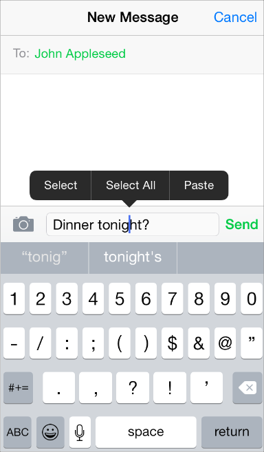
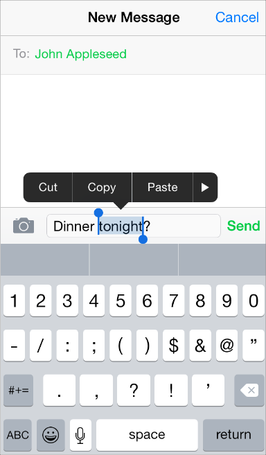

# 编辑菜单

用户能使用一个编辑菜单来完成诸如在文本视图、网页或图片视图中的剪切、粘贴以及选择的操作。
 
 
 

你可以调整一些菜单里的功能使用户能更多的控制你应用中的内容。举个例子，你可以：
-	列举出适合当前内容的标准菜单中的命令
-	在你的菜单显示前判定菜单显示的位置，以便防止你应用界面中重要的信息被其遮盖
-	定义当用户双击时会显示的菜单中默认选择的对象

你不能改变菜单本身的颜色和形状。

关于如何在代码中继承并实现这些行为的相关信息，参见 [Copy, Cut, and Paste Operations](https://developer.apple.com/library/ios/documentation/StringsTextFonts/Conceptual/TextAndWebiPhoneOS/UsingCopy,Cut,andPasteOperations/UsingCopy,Cut,andPasteOperations.html#//apple_ref/doc/uid/TP40009542-CH11) 章节。

为了确保编辑菜单在你应用中的表现符合用户期望，你应该：

**在当前情境下显示合理的指令。**例如，当没有对象被选中的时候，菜单中不应该包括复制或剪切命令，因为这些命令是针对被选择的内容而操作的。
相似地，如果有对象被选择的时候，菜单中不应该包括选择命令。如果你在自定义页面中支持编辑菜单，你就有责任确保菜单中显示的命令切合当前的情境。

**依据你的页面布局调节菜单显示效果。** iOS 系统在显示编辑菜单时，在选择点或插入点的上方或下方依据可获得的空间来放置菜单指针，这样用户就能看到菜单命令是如何与内容相关的。
必要的话，你可以通过程序在菜单显示之前决定它的位置，这样可以避免用户界面中的重要信息被挡住。

**支持两种手势来调用菜单。**虽然触控和长按手势是用户调用编辑菜单的两种首选方式，但他们也可以在文本页面中通过双击一个单词来选择该单词并同时调用菜单。
如果你在自定义页面中支持编辑菜单，确保它能支持两种手势。除此之外，你可以定义用户双击时默认选择的对象。

**避免在你的用户界面中创建和编辑菜单中功能相同的按钮。**例如，使用编辑菜单让用户进行复制操作远比提供一个有复制功能的按钮要好，因为用户将会想知道在你的应用中为什么会有两种方法做同样的事。

**如果静态文本的选择对用户来说是有用的，那么可以考虑使用它。**例如，用户可能想要复制一张图片的标题，但他们不可能想复制选项卡的标签或是屏幕的标题，比如“账户”。
在文本页面内，文字的选择应该是默认设置的。

**不要使按钮标题可选择。**如果按钮的标题是可选择的，用户很难在不激活按钮动作的情况下调用编辑菜单。
通常来说，像按钮这样用来操作的元素不需要是可选择的。

**将对撤销与重做的支持与对复制与粘贴的支持组合到一起。**人们经常希望在他们改变主意的时候能撤销最近的操作。
由于编辑菜单在它操作执行的时候是不需要确认的，你应该给用户提供撤销或重做这些操作的机会。

如果你需要创建自定义的编辑菜单项，需要像下面展示的这个例子一样遵循这些指导原则：

 
**创建直接作用于用户选择的包含编辑、修改或其他操作的编辑菜单。**当人们期望在当前的情况用标准的编辑菜单项操作文本或对象时，那么你的自定义菜单项最好能有符合用户的需求。

**将自定义项列在所有系统提供的项的后面。**不要将你的自定义项与系统提供的项混在一起列出。

**保持自定义菜单项的数量在合理的范围内。**你不应该给你的用户提供过多的选择。

**使用简洁的名称命名你的自定义菜单项并确保名称能准确的描述指令的作用。**通常，菜单项的名字应该是一个可以描述行为如何实现的动词。
虽然你通常会使用单个的大写单词作为菜单项的名字，但如果你必须使用一个短语作为名字时，就应使用标题式大写短语。（简洁的、标题性的大写词就是将除了文章、适当的连词、四字及四字以下介词之外的每个单词都要大写。）
