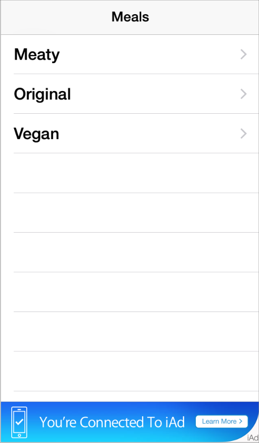
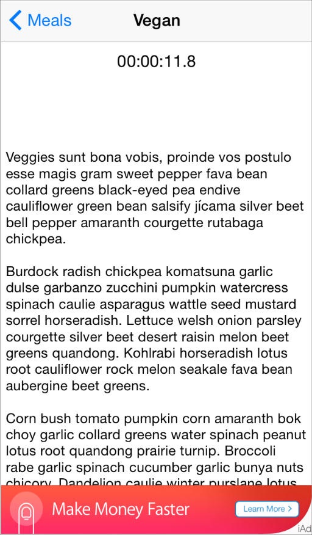
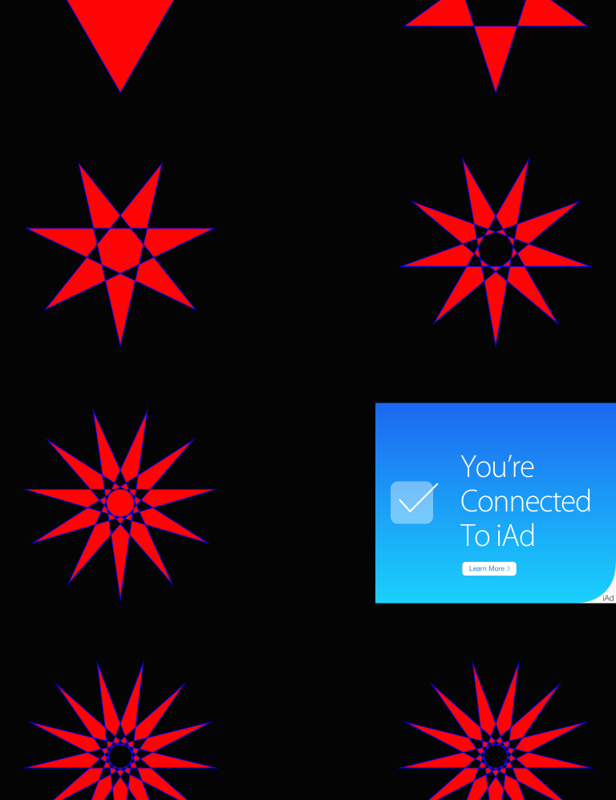
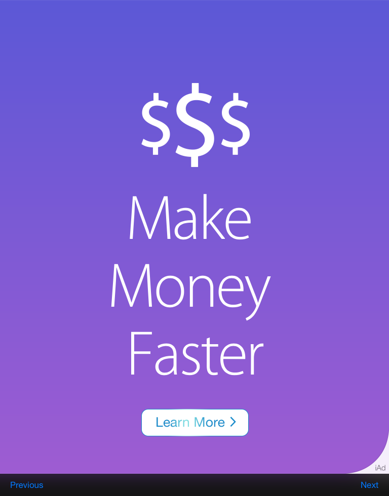

# iAd 富媒体广告

如果你允许你的应用中出现广告，那么你就可以通过用户浏览或者点击广告获得收益。（这里是一个放置 iAd 横幅的简单示例。） 

你可以使用由 iAd 网络提供的有确定的样式的广告。最简单的，这种样式可以包含一个作为广告入口的横幅。
当用户点击这个横幅时，广告执行提前编写好的事件，例如播放一段影片，展示可交互的内容或者启动浏览器打开一个页面。
这个事件展示的内容会盖住你当前的界面，或者使你的应用转换到后台运行。

有三种类型的横幅可供你使用：标准横幅，中等矩形横幅和全屏横幅。
所有类型的横幅都提供同样的功能，就是引导用户进入广告界面，只是它们的外观和行为不同。

*标准横幅* 占用屏幕较少的空间，并且从始至终都可见。你可以选择在应用的哪些页面来显示标准横幅，并且在这些页面布局时给横幅留出空间。

 
所有iOS的应用都可以展示标准横幅。你可以使用 [ADBannerView](https://developer.apple.com/library/ios/documentation/UserExperience/Reference/ADBannerView_Ref/index.html#//apple_ref/occ/cl/ADBannerView) 类提供的视图来显示标准横幅。

*中等矩形横幅* 和标准横幅的行为基本相同，同样也可以选择显示中等矩形横幅的位置。

 
中等矩形横幅只能在 iPad 应用中使用。你可以使用 [ADBannerView](https://developer.apple.com/library/ios/documentation/UserExperience/Reference/ADBannerView_Ref/index.html#//apple_ref/occ/cl/ADBannerView) 类提供的视图来显示中等矩形横幅。

*全屏横幅* 会占用屏幕的大部分甚至是所有空间，并且通常只在应用程序流的特定时间或特定位置显示。
你可以选择使用模式化方式来显示横幅或者用独立的页面来展示可滚动的内容。
（在下面的示例中，应用提供了一种杂志阅读的体验，通过翻页离开或回到全屏广告页面。）

 
你可以使用 [ADInterstitialAd](https://developer.apple.com/library/ios/documentation/iAd/Reference/ADInterstitialAd_Ref/index.html#//apple_ref/occ/cl/ADInterstitialAd) 类提供的视图来显示全屏横幅。

iAd 框架包含了所有类型的横幅，并且会在右下角显示 iAd 的标识。iAd 框架的设计固定在屏幕底部时最好看。

为了保证无缝的集成和提供最好的用户体验，请遵循以下几点。

**将标准横幅尽量放置在屏幕底部或底部附近。**这个位置的差别取决于底部是否有栏以及是什么样的栏。

| 栏 | 标准横幅的位置 |
| ------ |:-------:|
| 屏幕底部没有栏 | 屏幕底部 |
| 屏幕任何地方都没有栏 | 屏幕底部 |
| 底部有工具栏或者选项卡 | 底部栏上方 |

**将中等矩形横幅放置在不会干扰用户内容的地方。**和标准横幅一样，中等矩形横幅也放置在屏幕底部或底部附近时最好看。
同时将横幅放在屏幕底部附近也能减少干扰用户的可能性。

**用户体验有中断时使用模式化形式显示全屏横幅。**如果你的应用中有自然中断或者情景转换时，模式化方式显示的风格会更合适。
当你模式化展示全屏横幅时（通过使用 [presentFromViewController](https://developer.apple.com/library/ios/documentation/iAd/Reference/ADInterstitialAd_Ref/index.html#//apple_ref/occ/instm/ADInterstitialAd/presentFromViewController:) 实现）用户必须选择要么进入广告，要么关闭它。
出于这个原因，当用户有做出转变的预期时（例如完成了一个任务后）用模式化方式展示形式比较好。

**应用视图在切换时不要使用模式化展示全屏横幅。**如果用户在使用你的应用时会频繁的进行屏幕切换操作，例如杂志翻页或翻阅一些条目集合，此时使用非模式化的形式会更合适。
当你使用非模式化来显示全屏横幅时（通过使用 [presentInView](https://developer.apple.com/library/ios/documentation/iAd/Reference/ADInterstitialAd_Ref/index.html#//apple_ref/occ/instm/ADInterstitialAd/presentInView:) 实现），可以在你的界面中保留栏使用户通过应用控件进入或退出广告。
和其他横幅广告一样，点击全屏横幅会启动 iAd 体验，但是如果条件允许，你也可以在应用中支持横幅内的其他手势操作（例如拖动或滑动）。

**确保使用合适的动画效果来显示和隐藏非模式化的全屏横幅视图。**例如，一个杂志阅读应用的横幅可以用和杂志翻页一样的动画效果。

**确保横幅在应用中出现的时间和位置是合理的。**用户只有在不觉得广告打扰了他们的正常工作时才可能进入 iAd 。
这点对于游戏这样的虚拟式应用尤其重要：你肯定不想将横幅放置在影响用户玩游戏的位置。

**避免将横幅放置在用户只一扫而过的页面。**如果你的的应用包含用户可以快速略过的页面，那么最好不要将横幅放置这些页面。
因为通常用户在一个页面停留1、2秒后才可能点击进入一个广告。

**尽可能的双向展示横幅广告。**最好让用户在使用应用时不必旋转设备就能浏览广告。
当然，支持双向展示也能给你的广告提供更大的区域展示。想要学习如何确保转换方向时横幅能正常响应，请查看 [iAd Programming Guide](https://developer.apple.com/library/ios/documentation/UserExperience/Conceptual/iAd_Guide/Introduction/Introduction.html#//apple_ref/doc/uid/TP40009881) 。

**不要让标准或中等矩形横幅滚出屏幕。**如果你的应用需要滚动来展示内容，确保横幅一直固定在它的位置上。

**当用户浏览广告或与广告进行交互时，暂停那些吸引用户注意力或需要操作的活动。**当用户选择浏览广告时，他们不想因此错过应用中的事件，也同样不想让应用打断广告体验。
一个好的经验方法是像应用转入后台运行那样暂停当前活动。

**除非有特殊情况，否则不要中断广告。**一般情况下，在用户浏览并与广告交互时，应用还是在继续运行并接收事件的，所以也有可能突然出现一个事件需要获得用户的注意。
然而，需要打断一个正在运行的广告的场景其实非常少。有一种可能的情形是应用提供互联网语音协议服务（ VoIP ）时。在这种应用中，有电话接入时可能会取消正在运行的广告。

`注意：取消广告可能会对应用能接受的广告类型以及能获取的收益有不好的影响。`

