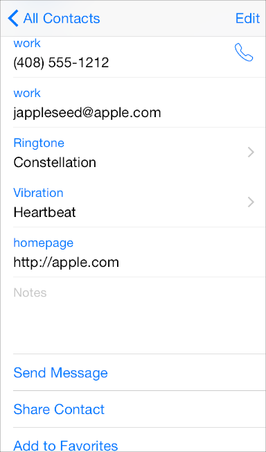
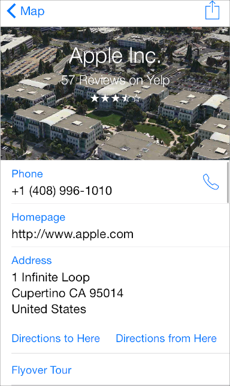
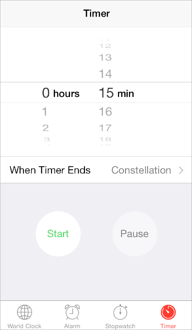
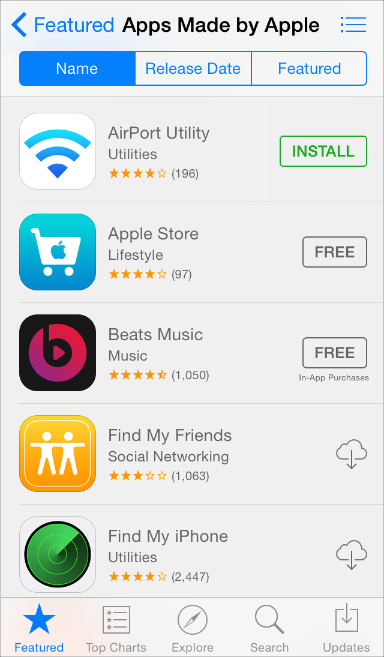
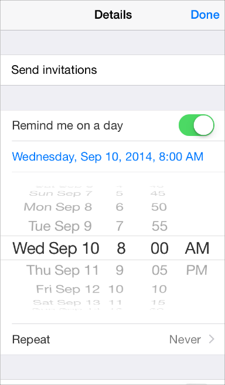
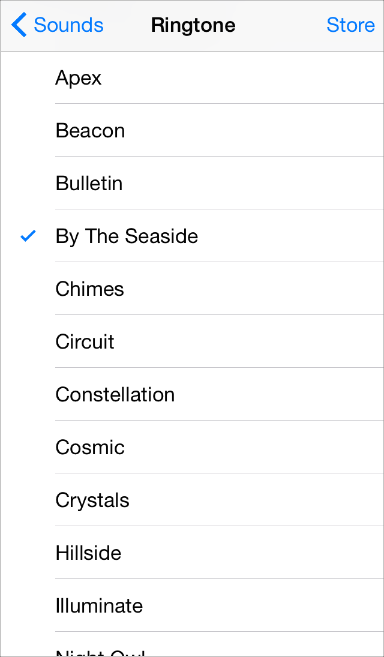

# 交互与反馈 (Interactivity and Feedback)

## 用户知道标准手势

用户使用点击、拖拽、捏合等手势和 app、ios 设备互动，手势会令用户更贴近设备，并且能让用户直观地感受到屏幕上的物体。人们希望所有 app 中的手势都是相同用法的。

<object class="svg-animation" data="Art/tap.svg" type="image/svg+xml" width="128" height="128"></object>

**点击。**按压或选择一个控件或选项。

<object class="svg-animation" data="Art/drag.svg" type="image/svg+xml" width="128" height="128"></object>

**拖拽。**移动一个元素。

<object class="svg-animation" data="Art/flick.svg" type="image/svg+xml" width="128" height="128"></object>

**滑动。**快速滑动屏幕。

<object class="svg-animation" data="Art/swipe.svg" type="image/svg+xml" width="128" height="128"></object>

**扫。**使用一个手指扫动屏幕，可以回到之前的屏幕、可以拉出隐藏视图，也可以滑出删除按钮。使用四个手指，可以在 ipad 上滑动选择 app。

<object class="svg-animation" data="Art/double-tap.svg" type="image/svg+xml" width="128" height="128"></object>

**双击。**放大内容或图片、使内容居中，也可以恢复缩小的内容。

<object class="svg-animation" data="Art/pinch.svg" type="image/svg+xml" width="128" height="128"></object>

**捏合。**向外捏合用来放大；向内捏合用来缩小。

<object class="svg-animation" data="Art/touch_hold.svg" type="image/svg+xml" width="128" height="128"></object>

**长按。**当编辑文本时，用来定为光标的位置。

<object class="svg-animation" data="Art/shake.svg" type="image/svg+xml" width="128" height="128"></object>

**摇晃。**撤销操作。

除了用户熟悉的标准手势，ios 也定义了可以调用全系统动作的手势，例如展示控制中心和通知中心。用户可以在任何 app 中使用这些手势。

**不要给标准手势定义不同的行为。**除非你的 app 是游戏，重新定义标准手势的含义会误导用户，而这会让人觉得你的 app 很难使用。

**不要再创建和标准手势功能相同的新手势。**人们已经熟悉了标准手势，他们不会希望再学习一个和已知手势功能相同的新手势。

**使用复杂的手势作为某个任务的快捷键，但不要让它成为唯一的方式。**尽可能地给用户提供一个简单直接的方式，即使只是增加一两下点击也不行。简单的手势能让用户更关注体验和内容，而不是交互本身。

**一般情况下，不要定义新手势，除非你的 app 是游戏。** 在游戏或其他沉浸式的应用中，自定义手势是一个十分有趣的体验。但是对于那些帮助人们完成重要工作的 app，最好使用标准手势，因为人们不必占用精力来记住它们。

**在常规环境中，考虑使用多指手势。**尽管复杂的手势不适合于每一个 app，它们却可以丰富用户的应用体验，例如游戏或创造型的应用。要时刻记得非标准手势并不容易发现，所以不要使用的太多，如果要用的话，让它成为完成这个动作的唯一方式。

## 用交互元件吸引用户点击

为了体现交互性，内置 app 使用了多种方式，包括颜色，位置，上下文，多含义的图标和标签。用户很少需要额外的用来引导他们点击的元件装饰。

一个关键色可以给用户很强的视觉引导，尤其是在你的 app 里没有其他冗余的颜色时。为了对比强烈，用蓝色标记可以交互的元件，并且让 app 有统一、易于识别的风格。

返回按钮使用了多个方法来暗示它的交互性和功能：它用来返回导航，显示了一个指向后方的箭头图标，它使用了典型的关键颜色，并且它也可以显示先前页面的标题。

一个清楚地表明需要点击的图标或标题会吸引用户点击它。例如，“地图”中的标题：“Flyover Tour” 和 “Directions to Here”，清楚地表示了用户可以点击它的意图。再与关键色相结合，就可以省去按钮边界和其他多余的点缀了。

**在内容区域，有必要给按钮添加边界或背景。**操作条、动作菜单或警告框中的按钮是不需要边界的，因为用户知道这些区域中的大多数按钮都是可以点击的。但在内容区域，按钮需要边界和背景来把它们和其他内容分离开。例如，“音乐”，“时钟”，“相册”，“App Store” 中的一些按钮就是这样做的。

“相册” 使用按钮边界将它和底部的解释文本分离开。

“时钟” 在秒表和计时器中用背景来吸引人们注意到开始和暂停键，并且这也易用用户点击。

“App Store” 在列表中的每一行使用按钮边界来区分获得详细信息的点击和下载应用的点击。

## 反馈有助于理解

反馈会帮助用户了解 app 在做什么，即将做什么以及操作的结果。UIKit 控件和视图提供了多种反馈机制。

**在你的 UI 中，尽可能的融合状态和其他相关的反馈信息。**最好能让用户在不进行操作、不被打断的情况下获得这种信息。例如，“邮件” 会在工具栏里显示邮箱状态，而工具栏并不会和用户正在使用的内容相冲突。

**避免不必要的警告。**警告框是一个重要的反馈机制，但它应该只能用于传递重要且理论上可行的信息。如果用户看了太多不重要的警告，他们很快会忽视所有警告。想了解更多关于警告框，请点击[Alert](https://developer.apple.com/library/ios/documentation/UserExperience/Conceptual/MobileHIG/Alerts.html#//apple_ref/doc/uid/TP40006556-CH14-SW2)

## 简化输入信息的方式

输入信息会浪费时间和经历，无论是点击控件输入还是键盘输入都是如此。如果你的 app 在提供有用信息之前就让用户输入大量的内容而降低了他们的效率，用户就会对你的 app 感到灰心。

**让用户进行更多的选择而不是自己输入。**例如，你可以用选项控件或列表视图来代替文本输入，因为大多数人比起打字都更喜欢选择。

备忘录中的日期选择：

设置中的选项列表：

**在合适的时候可以从 ios 中获取信息。**人们会在他们的设备上储存很多信息。不要让用户给你提供那些你可以自己找到的信息，例如他们的联系人和日历信息。

**通过给用户提供有用的信息来平衡输入要求。**付出和得到的概念能让用户感到工作在进行。
