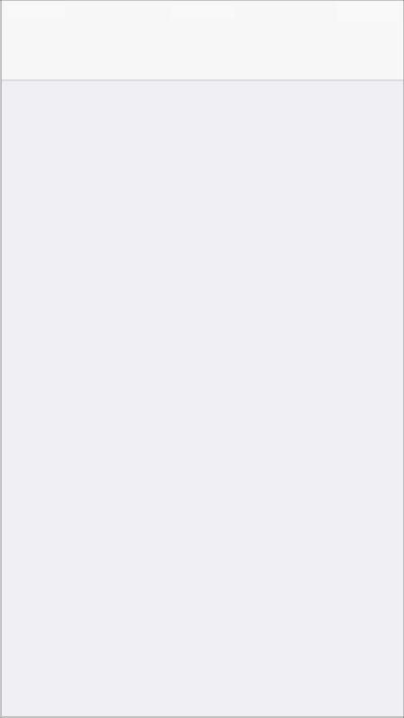

# 启动画面

当你启动应用时，iOS 会呈现启动文件或启动画面所提供的一个简单的占位图像。占位图像会迅速地被应用的第一屏替换，这样可以让用户感觉到应用的响应非常迅速。每一个应用都必须提供一个启动文件，或至少一张静态图片。

在 iOS8 及之后的系统中，你可以使用一个 XIB 或故事板文件来替代静态的启动文件。在 Interface Builder 中创建了一个启动文件时，使用尺寸类来为不同的界面环境定义不同的层，你还可以使用 Auto Layout 来调整细节。尺寸类和 Auto Layout 可以使得在只创建一个启动文件的情况下，在所有的设备上都能够有良好的呈现。（了解不同呈现环境和尺寸类的概述，查阅 [Build In Adaptivity](https://developer.apple.com/library/ios/documentation/UserExperience/Conceptual/MobileHIG/LayoutandAppearance.html#//apple_ref/doc/uid/TP40006556-CH54-SW2)；学习如何在　Interface Builder 中使用尺寸类，查阅 [Size Classes Design Help](https://developer.apple.com/library/ios/recipes/xcode_help-IB_adaptive_sizes/_index.html#//apple_ref/doc/uid/TP40014436)。）

如果你想要支持 iOS 更早期的版本，可以继续使用静态启动画面而不是启动文件。

>重要  
使用一个启动 XIB 或故事板意味着你的应用是在 iPhone 6 Plus 或 iPhone 6 上。

下面所提到的设计指南对启动文件和静态启动画面两种情况都适用：

**设计一个简单的启动画面可以提升用户体验**

通常情况下，启动画面不需要提供：
- 一个“进入应用的过程”，如泼溅的屏幕效果
- 一个“关于”窗口
- 品牌元素，除非这些元素是应用第一屏的一部分。

由于用户会频繁地在不同的应用之间切换，所以你应该使启动时间尽可能短，并且设计一个可以削弱切换时重新启动的体验的启动画面，而不是加重用户对此的印象。

**设计一个与应用第一屏统一的启动图像**，除了以下情况：

- **文本**。启动画面是静态的，所以展示在启动图像中的任何文本都不会受到限制。
- **可能会变化的界面元素**。如果启动画面中所包含的某些元素在启动结束后在外观上会有变化，那么用户可能会对启动画面和第一屏之间的这个变化感到不舒服。

的确，遵守这些规则会让你创建出一个普通无趣的启动画面，但请记住，应用的启动画面不需要添加任何的艺术表达效果，它仅仅是为了增强用户对应用可以被快速启动并使用的概念。例如，系统应用和天气应用都仅仅提供了一张背景图作为启动画面。

系统设置启动图片

天气应用启动图片

使用静态启动图像时，你需要为不同的设备创建不同尺寸的图片，所有设备上的静态启动图像都必须包含状态栏的区域。具体的尺寸，请查阅[表 41-1](https://developer.apple.com/library/ios/documentation/UserExperience/Conceptual/MobileHIG/IconMatrix.html#//apple_ref/doc/uid/TP40006556-CH27-SW2)

虽然在 iPhone 6 和 iPhone 6 Plus 上最好是使用启动文件，但若需要，也可以将其替换为静态启动图像。如果你需要为 iPhone 6 和 iPhone 6 Plus 创建静态启动图像，请使用以下尺寸：

对于 iPhone 6：
- 人像为 750 x 1334 像素(@2x)
- 风景为 1334 x 750 像素(@2x)

对于 iPhone 6 Plus：
- 人像为 1242 x 2208 像素(@2x)
- 风景为 2208 x 1242 像素(@2x)

使用静态启动图像时，你可以在图像的命名中体现如果使用该图像。启动图像文件名的格式中应包含详细的有关设备、分辨率及适用情况的信息。学习如何正确地命名启动图像，参见 [App Launch(Default) Images](https://developer.apple.com/library/ios/documentation/iPhone/Conceptual/iPhoneOSProgrammingGuide/ExpectedAppBehaviors/ExpectedAppBehaviors.html#//apple_ref/doc/uid/TP40007072-CH3-SW3)。
