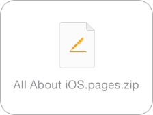
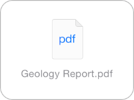

# 快速查看
使用 Quick Look ，即使你的应用是打不开这个文件的,用户也可以在你的应用内预览文件，。
例如，你可以允许用户预览一些从网站上下载或从其他来源收到的文件。

 
想要学习如何在应用中加入支持 Quick Look 文件预览功能，请查看 [Document Interaction Programming Topics for iOS](https://developer.apple.com/library/ios/documentation/FileManagement/Conceptual/DocumentInteraction_TopicsForIOS/Introduction/Introduction.html#//apple_ref/doc/uid/TP40010403) 。

用户在应用中预览文件之前，他们可以在你自定义的视图中查看文件的信息。例如，用户从一封邮件中下载了附件之后，邮件应用会在邮件中以自定义的视图展示文件的图标、标题和大小。
用户可以通过点击它来预览文件。

 
你可以在应用中用一个新的视图来显示文件预览，使用全屏或者模式化视图。展示的形式取决于你的应用运行在什么设备上。

**在 iPad 上使用模式化视图显示文件预览。** iPad 的大屏幕很适合在一个方便用户离开的虚拟式环境中显示文件预览。
缩放操作很适合显示预览。

**在 iPhone 上可以使用专用的视图，最好是导航视图来显示文件预览。**这样可以使用户在应用情境中通过导航进入文件预览并且不会丢失在应用中的内容。
虽然也可以在 iPhone 应用中使用模式化方式显示文件预览，但并不推荐这样。（注意缩放操作在 iPhone 上并不适用。）

当然，在导航视图中显示文件预览可以使 Quick Look 在导航栏上放置特定的预览控件。（如果你的视图已经有工具栏， Quick Look 会将预览控件放在工具栏上。）
